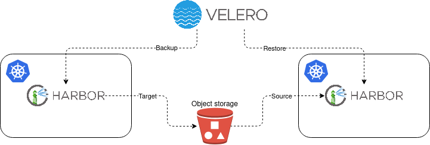

# Migration



This page aims at providing a step-by-step guide for lift and shift migration of [Harbor](https://goharbor.io/)
container registry, which operates in the Kubernetes environment and is deployed with Helm.
This migration scenario uses [Velero](https://velero.io/) tool which
enables moving your Harbor instance as-is from one Kubernetes environment to another
Kubernetes environment. The motivation behind this could be e.g. migration
from one cloud provider to another, an outdated Kubernetes environment of your Harbor 
instance or avoiding the Harbor in-place upgrade.

Note that the official Harbor's documentation contains an "[Upgrade Harbor and Migrate Data](https://goharbor.io/docs/main/administration/upgrade/)" page
that instructs users on how to upgrade and migrate Harbor data from one instance to
another. This tutorial supports only deployments that have been installed by [Harbor installer](https://goharbor.io/docs/main/install-config/download-installer/) script. 
Hence, Harbor instances running in docker containers and spawned by docker-compose.

Note that this guide is not limited to Harbor deployments that utilize SCS environments.
Visit the [prerequisites](#prerequisites) section to see what is required for a successful
migration. These prerequisites come out of the box when the SCS infrastructure and KaaS
are used for Harbor deployment, hence it is convenient to use them. 

## Prerequisites

As this scenario uses a backup and restore procedure for the migration process, this section
refers to the prerequisites section in [Harbor - backup and restore](backup_and_restore.md#prerequisites)
docs page. 

### Kubernetes clusters

This migration scenario expects that you want to migrate your Harbor instance
between different Kubernetes clusters that could live in different environments (e.g.
OpenStack projects) or even in different cloud providers. Let's call them Cluster_A and 
Cluster_B. Cluster_A represents the Kubernetes cluster where your Harbor currently operates and 
Cluster_B represents the target Kubernetes cluster to which you want to migrate your Harbor. 

As Cluster_A and Cluster_B do not have to share the same infrastructure it is convenient to 
use a full Harbor data backup (not a snapshot) using [Restic](https://restic.net/)
integration in Velero. In this case, Cluster_A and Cluster_B should have 
Kubernetes version **1.16** or greater. 
For further details about Restic-Velero integration refer to the  
related [Velero docs](https://velero.io/docs/main/file-system-backup/). 

Kubernetes versions of Cluster_A and Cluster_B may differ. In this case, it is 
not unusual to see the Kubernetes API group versions differing between clusters. This
incompatibility may cause issues during the migration of your Harbor instance. By default,
Velero only backs up resources that use the preferred version of the Kubernetes API. 
However, Velero also includes a feature, [Enable API Group Versions](https://velero.io/docs/main/enable-api-group-versions-feature/),
that overcomes this limitation and backup all Kubernetes API group versions that are 
supported on the source Cluster_A. Then, if this feature is also enabled on the Cluster_B,
Velero will make the best choice of Kubernetes API version which is defined in the group
name of both source Cluster_A and target Cluster_B based on API group version priority order, 
read [docs](https://velero.io/docs/main/enable-api-group-versions-feature/) for further details.
If the above is the case consider installing Velero on both clusters
with a feature flag `--features=EnableAPIGroupVersions`. Note that this feature is still in beta.

### S3 bucket and EC2 credentials

This guide assumes that the public cloud's object store with S3-compatible API is available as
the storage backend for Velero. Refer to the [S3 bucket and EC2 credentials](backup_and_restore.md#s3-bucket-and-ec2-credentials)
section in the backup and restore docs and create a bucket that will be later used for
the migration.

### Velero client

Install the Velero client on your local environment, refer to [Velero client](backup_and_restore.md#velero-client).

### Velero server

Install Velero server components along with the appropriate plugins, into the both
(Cluster_A and Cluster_B) clusters. Keep in mind that we will use Restic uploader in
Velero, hence follows interactions on how to do that in the related docs section [Velero server](backup_and_restore.md#velero-server).
Do not forget to add `--kubeconfig` argument to install Velero server components
to the Cluster_A and then to the Cluster_B. The rest of arguments should be the same:

  ```bash
  velero install \
    --kubeconfig <path to the kubeconfig file of Cluster_[A,B]> \ 
    --provider aws \
    --plugins velero/velero-plugin-for-aws:v1.6.1 \
    --bucket velero-backup \
    --secret-file ~/.aws/credentials \
    --use-volume-snapshots=false \
    --uploader-type=restic \
    --use-node-agent \
    --backup-location-config region=RegionOne,s3ForcePathStyle="true",s3Url=https://api.gx-scs.sovereignit.cloud:8080
  ```

It is a good practice to configure the backup location in the Cluster_B as read-only. 
This will make sure that the backup created from Cluster_A is not deleted from the object
store by mistake during the restore to Cluster_B. To do this you can just edit the `default`
BackupStorageLocation resource in Cluster_B.

```bash
$ kubectl -n velero --kubeconfig <path of Cluster_B kubeconfig> edit backupstoragelocations default
# Set the `accessMode` to `ReadOnly`
# spec:
#   accessMode: ReadOnly
```

## Migration

Before we start to migrate Harbor instance from one environment to another go through the 
[Backup and restore](backup_and_restore.md#backup-and-restore) section and read 
various limitations of the backup/restore process to be aware of the potential impact on
your Harbor instance.

1. Backup Harbor instance in Cluster_A
    - [Set Harbor to the `ReadOnly` mode](https://goharbor.io/docs/main/administration/backup-restore/#set-harbor-to-readonly)
    - Exclude the volume of Redis in backup in Cluster_A
      ```bash
      # replace the namespace and pod name with yours
      kubectl -n default --kubeconfig <path of Cluster_A kubeconfig> annotate pod/harbor-harbor-redis-0 backup.velero.io/backup-volumes-excludes=data
      ```
    - Back up Harbor in Cluster_A
      ```bash
      velero backup create harbor-backup --kubeconfig <path of Cluster_A kubeconfig> --include-namespaces default --default-volumes-to-fs-backup --wait
      ```
      This creates a full backup of all resources in the given namespace including their
      persistent storages (besides Redis PV). 
    - Optionally: [Unset Harbor from the `ReadOnly` mode](https://goharbor.io/docs/main/administration/backup-restore/#unset-readonly).
      Keep in mind that the `ReadOnly` mode protects your Harbor instance from deleting
      repository, artifact, tag, and pushing images. This ensures that the Harbor instance
      in Cluster_A will be in sync with the Harbor instance in Cluster_B after you restored 
      Harbor instance from the backup in Cluster_B. Therefore, it is recommended to **not**
      unset Harbor from the `ReadOnly` mode in Cluster_A. 
        
2. Restore Harbor instance in Cluster_B
    - Restore from the Backup
      ```bash
      # replace the backup and restore names with yours
      velero restore create harbor-restore --from-backup harbor-backup --kubeconfig <path of Cluster_B kubeconfig> --wait 
      ```
      Velero backed up the whole namespace where the Harbor instance lives in Cluster_A,
      therefore the restored namespace in Cluster_B may contain resources (e.g. service,
      ingress, TLS certificates) that expose Harbor instance in the same way as in 
      Cluster_A. It is a good practice to test this Cluster_B instance before you allow
      users to use it.
    - [Unset Harbor from the `ReadOnly` mode](https://goharbor.io/docs/main/administration/backup-restore/#unset-readonly).
      As we set Harbor in Cluster_A to ReadOnly when doing the backup, the instance is
      still in ReadOnly mode after restoring. Unset Harbor from the ReadOnly mode after
      you check its functionality.
